# Optimizing Retail Strategy based on the Pattern of Products in Groceries Transaction

### Introduction

A simple groceries list or a receipt provides a pattern of buying behavior of customers. It shows the relationship between products and the chance to inform business decisions such as product placement or even combination packages in order to maximize profits. So, what kind of relationship of product that we have in UK and Ireland wholesalers? How can that information be used to help business decisions making?

This project has the following goal:
Find a strong relationship between products that leads to the most profitable product combination. 

### About the Data

Description:
The <a href="https://archive.ics.uci.edu/ml/datasets/online+retail"> data set </a> contains all the transactions occurring between 01/12/2010 and 09/12/2011 for a UK-based and registered non-store online retail.The company mainly sells unique all-occasion gifts. Many customers of the company are wholesalers.
  
Before transforming the data set into one transaction for each InvoiceNo and building the association rules model, I undertook exploratory data analysis and preprocessing to see if I could uncover any suspicious pattern in the data as the initial step of data cleaning. 

## Exploratory Data Analysis & Preprocessing

In this part, I implemented the following steps:
- Checking the head of the data set

As you can see from the first 5 observations below, we have a clean description of products with capital letters including its InvoiceNo. 
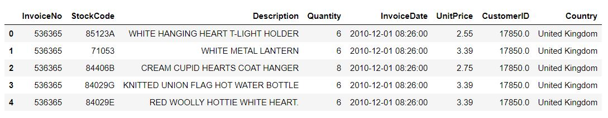

- Checking the tail of the data set, it has invalid invoice with negative quantity value.
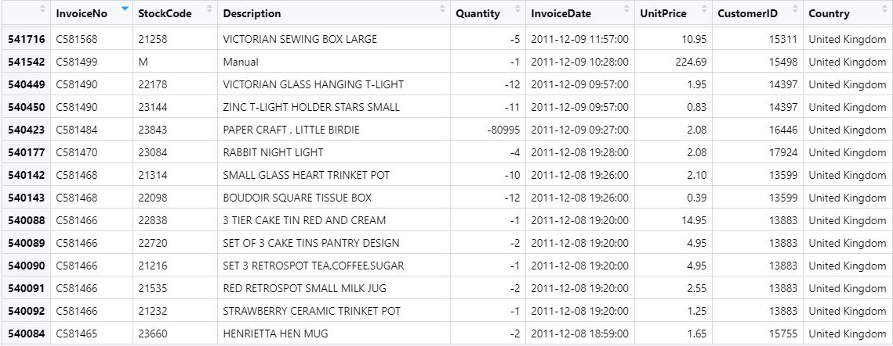

- After removing the observation with negative quantity value and make sure all of the data is completed. Here is the final condition of the clean and ready to use data, the final data count ended up being 397942.

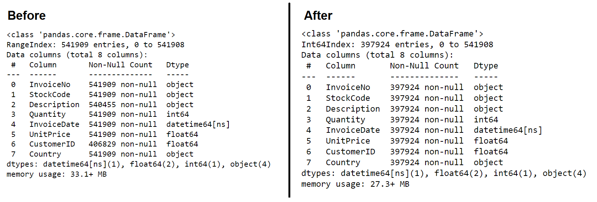

- Check the country with the highest number of observations

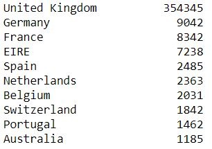

The data set of UK has a highest number of observations and also we will use Ireland data set. Both countries are situated next to each another and we want to see whether they have the same pattern or not. In the following explanation we will see the difference between them and how to model the association rules of products for both countries. But before that, we will have a brief description about the Apriori algorithm, why we use it and how to use it. 

## Apriori Algorithm
**Apriori algorithm** or we also can call it association rules mining, will take the data as the transaction object on which mining is to be applied. Before we discuss deeper about the algorithm, there are three terms that we should know: Support, Lift and Confidence. 

The main reason we use Apriori Algorithm is because it uses a breadth-first search strategy to count the support of itemsets and uses *a candidate generation function* which exploits the downward closure property of support. It considers every combination and all length of transactions (while we also can set it arbitrarily).

**Support** indicates the probability that a randomly chosen transaction contains both item A and B. The higher support gives more benefit into business when they use it to make a product package or combination.

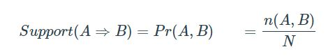

From the formula, support of A and B is the probability of the frequencies of product A and B together in one transaction compare to the whole number of transactions. More frequent the transaction, the higher its support would be.

**Confidence** is the probability that an product B is purchased in a randomly chosen transaction given that product A has been purchased.

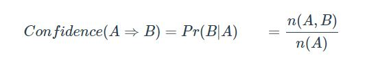

The confidence indicates the direction for cross-selling, it shows how ‘sure’ we are that product A and B be bought together by comparing the number of transactions those have product A and B with the number of transactions whose product A.

**Lift** indicates the strength of the relationship between the products. When the value of lift is greater than 1, it indicates a higher relationship.

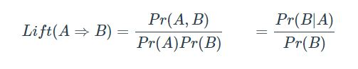

## Association Rules Analysis of UK Data Set

First of all, subset the data for UK. We can see the data below:

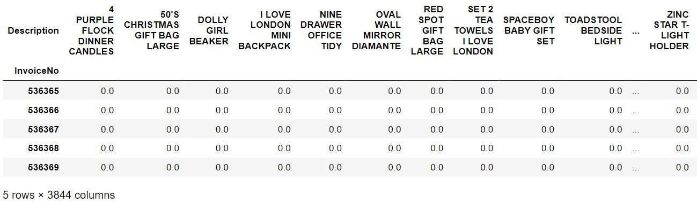

This analysis requires that all the data for a transaction be included in 1 row (like a receipt, we have one receipt number and also the groceries list) while the items should be 1-hot encoded. So, we transform the data into a matrix with the list of products, we give a 'flag' 1 when the product is exist and 0 when it is not on the transaction.

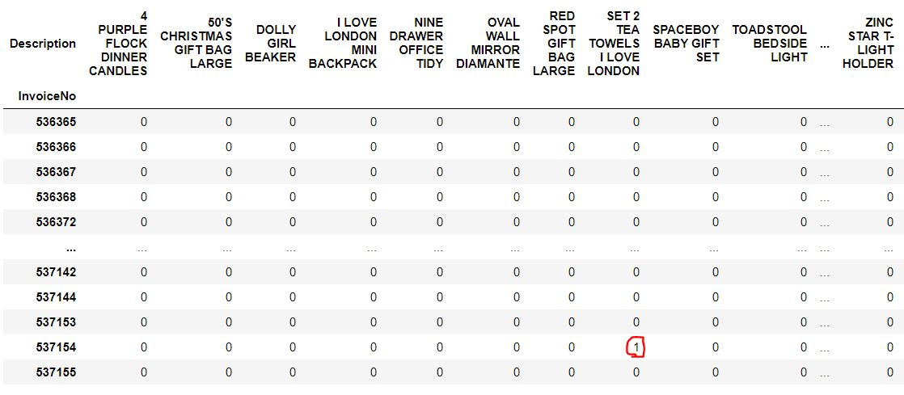

Then, what is the most frequent product in UK? The answer is "WHITE HANGING HEART T-LIGHT HOLDER"

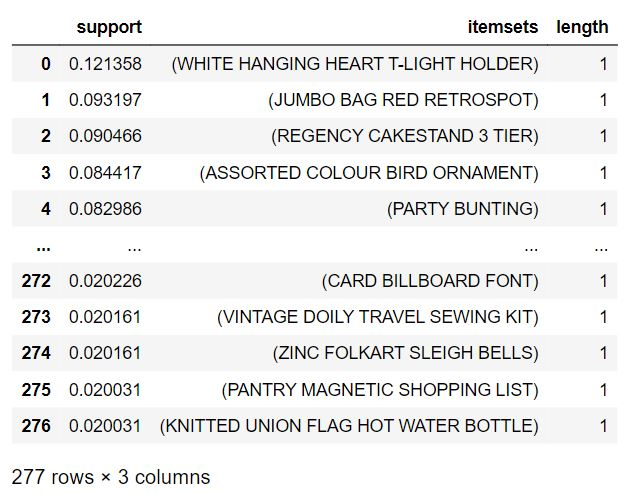

### The Customers in UK tend to buy the Teacup with Various Colours

In constructing the Apriori algorithm, we have to set the minimum support and also the minimum confidence into the apriori function from **MLxtend**.
We set the confidence as 70% as we have a large number of observations for UK, and 2% for the support. 

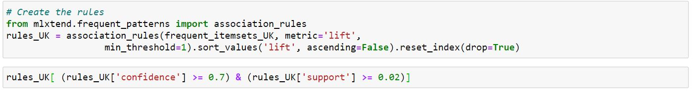

The result is sorted based on lift in descending order, means the strength of relationship is sorted from the strongest and weaker as the lift is getting smaller.  
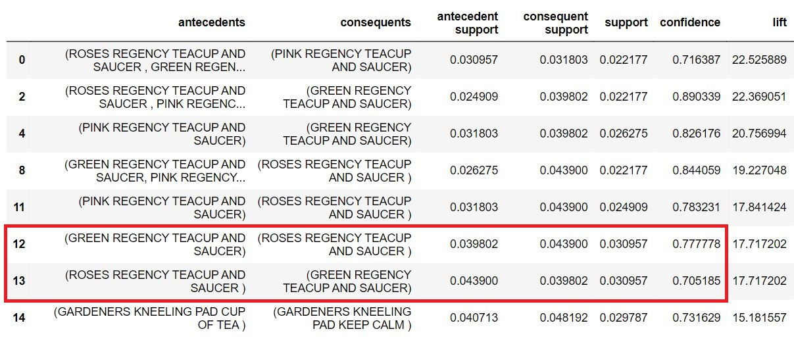

Association rules are normally written like this: {ROSES REGENCY TEACUP AND SAUCER, GREEN REGENCY TEACUP AND SAUCER} -> {PINK REGENCY TEACUP AND SAUCER} which means that there is a strong relationship between products: "ROSES REGENCY TEACUP AND SAUCER, GREEN REGENCY TEACUP AND SAUCER" and "PINK REGENCY TEACUP AND SAUCER" since customers purchased them in the same transaction.

In the above example, the {ROSES REGENCY TEACUP AND SAUCER , GREEN REGEN...	} is the antecedent and the {PINK REGENCY TEACUP AND SAUCER} is the consequent. Both antecedents and consequents can have multiple items. In other words, {ROSES REGENCY TEACUP AND SAUCER, GREEN REGENCY TEACUP AND SAUCER, etc} -> {PINK REGENCY TEACUP AND SAUCER, etc} is still a valid rule.

*Support* of (ROSES REGENCY TEACUP AND SAUCER, GREEN REGENCY TEACUP AND SAUCER) and PINK REGENCY TEACUP AND SAUCER is 0.022177, it means they appear together in 2.2177% of transactions. In other words, on 10000 transactions there are on average 2.2 transactions with both together. The value seems to be very 'low' because of the size of data. We will see more 'impactful' insight with Ireland data set. 

*Confidence* is the percentage of transactions that contain the two products together, out of the transactions containing one of the two products. As a consequence, there are always two confidence numbers for each couple of products.

Confidence is useful because it gives the direction of the cross-selling. We can make the hypothesis that it’s easier to sell ‘ROSES REGENCY TEACUP AND SAUCER’ to someone buying ‘GREEN REGENCY TEACUP AND SAUCER’, with confidence up tp 77.78% compared to the opposite (only 70.5%).

However, we should keep in mind that the high-confidence rules can be misleading, because the confidence measure ignores the support of the product appearing in B. Lift measure overcomes this problem, as it considers the support of both products A and B in the ratio.

*Lift* gives the strength of the relationship between two products. The rule of thumbs:
- When lift is 0 - 1, there is no relationship.
- When lift is more than 1, the products have a positive relationship, the customer buy the products more frequently than it would happen.
- When lift is lower than 0, the customers buy the products less frequently than it would happen.

Lift measures the extent to which A and B are not independent and despite having the same value, the interpretation of the two lift values should not be the same because the maximum attainable value is different

As an example, the first rule shows when "ROSES REGENCY TEACUP AND SAUCER, GREEN REGENCY TEACUP AND SAUCER" are together with "PINK REGENCY TEACUP AND SAUCER" , it has a Lift of 22.53, meaning that consumers buy them together about ~22.5 more times than it would happen by chance. This is a very strong relationship.

As for the visualization, here is top 4 rules based on their value of lift. 

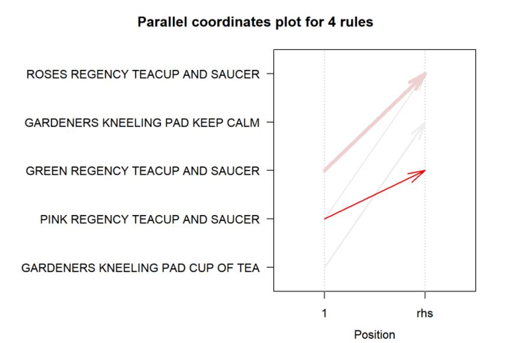

And also a graph to show the relationship between the products where the arrows and rules with darker red color has higher lift. 
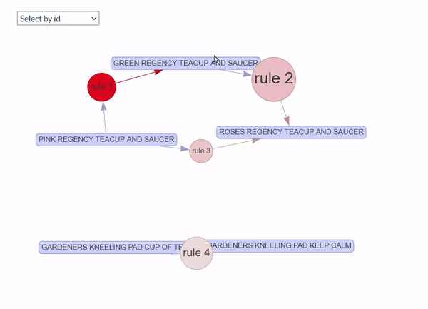

## Association Rules Analysis of Ireland (EIRE) Data Set

After the same process is done with the Ireland data, we have the result of the most frequent items in Ireland. 

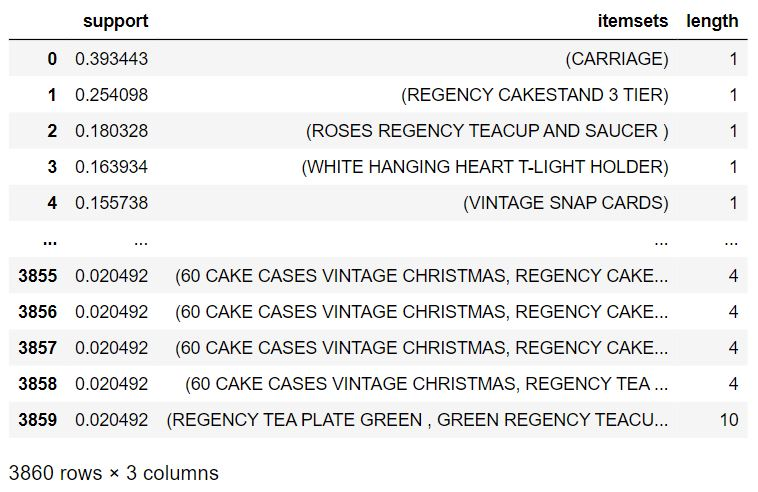

Irish love carriage as it is the first rank of most frequent item, follows by "REGENCY CAKESTAND 3 TIER" which is the third rank on most frequent list in UK data set. Both countries seems to share the same interest with the cakestand. 

### The Customers in Ireland tend to buy the Cakestand
For Ireland data set, the setting of minimum support and minimum confidence are changed since the number of observations is smaller rather than the UK data set. 

We set the confidence as 95% (before is 70%) as we have smaller number of observations rather UK, and increase minimum support from 2% into 7%. 

There are three rules with confidence value equal to 1.0. These rules are very important and the items should have a high priorities in the marketing strategy. 

## Conclusion
We have done Association Rules Analysis using an actual online retail transaction data from UK and Ireland. The result of this market basket analysis could be used for the optimization of retail strategy. There are marketing insights that we can optimize, here is the principle of Marketing Mix for the items with a strong relationship:
- Place: We can put the items with strong relationship close to each other, in this case we can design their image close to each other on the webpage.
- Promotion: We can put them together with additional discount or create a new promotion strategy
- Price: We can calculate the pricing strategy for the products. 

For UK wholesalers, I recommend to put these types of teacup and saucer: ROSES REGENCY, GREEN REGENCY and PINK REGENCY next to one another. Another recommendation, they can give a discount price for ROSES REGENCY or GREEN REGENCY when the customers plan to buy the PINK REGENCY. Best of all, the customers would be happy to pay a lower price for the product bundling consist of these teacups and saucers. 

For Ireland, I recommend to 
